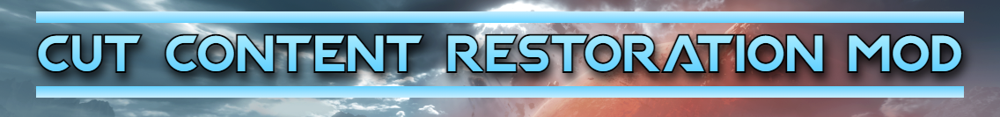
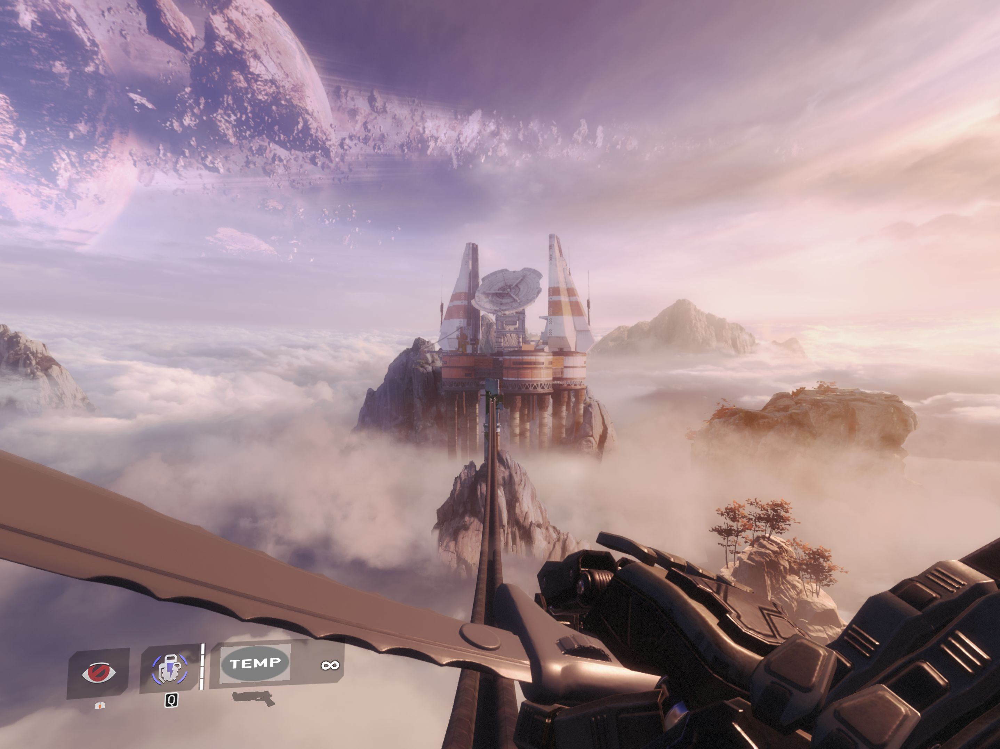
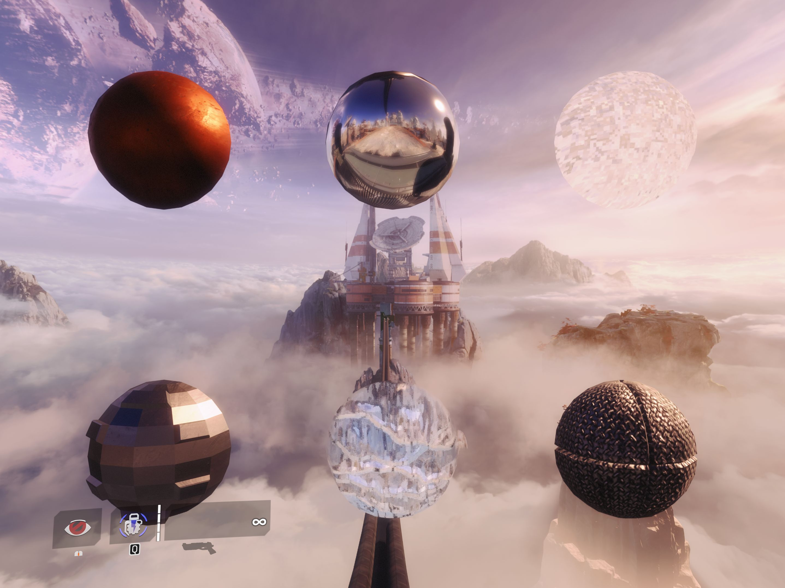
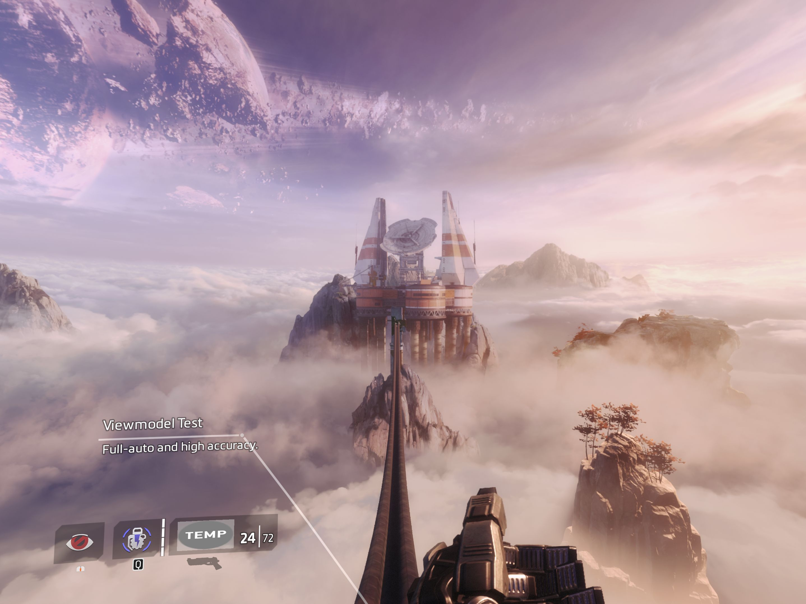
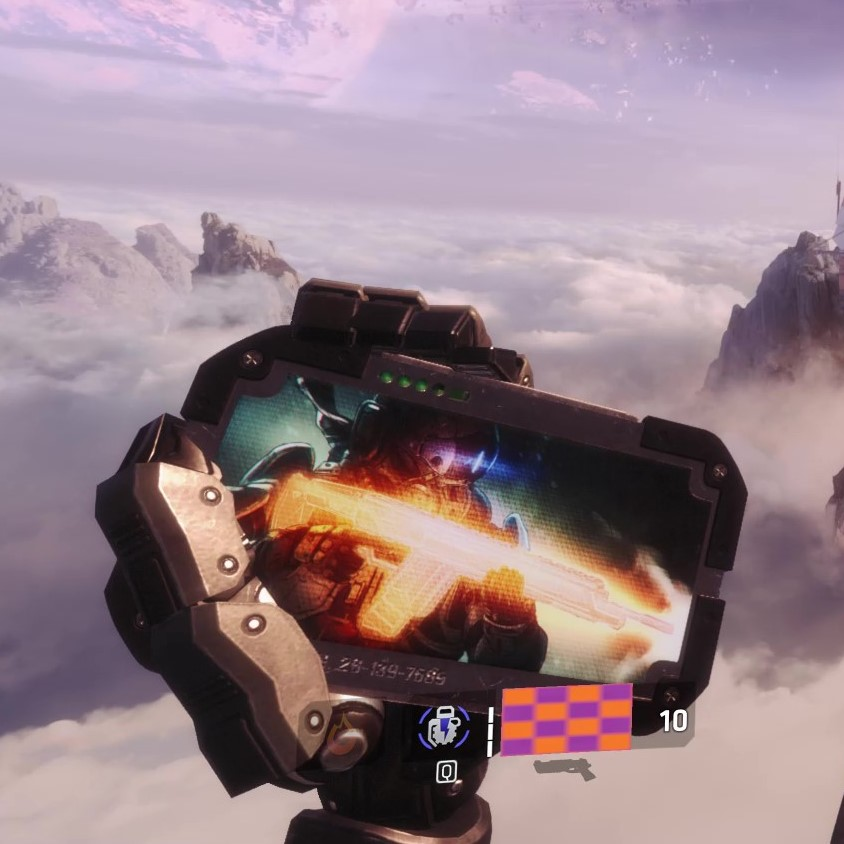
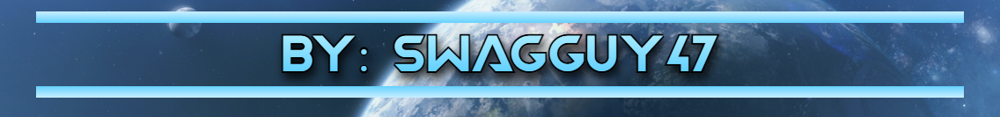

# TF2-cut-content-restoration-mod

USE THE LATEST RELEASES FOR THE MOD, CLONING WILL GIVE YOU A VERSION WITH INCOMPLETE FEATURES AND LOTS OF BUGS

If you want to use the Dev menu which is included in this mod, open Origin, set your Titanfall 2 Launch properties to: 

'-dev +developer 1'

Most parts of the menu still don't work, I'll probably be slowly adding more support for it in future patches. But RN all the start points work. Go try That!
____________________________________
**This Mod Contains:**

-Restored weapons which were previously cut or unusable normally/in Icepick.

-Recreated weapons based off leftover game data and/or released information.

-Restored abilities which were previously cut or unusable normally/in Icepick.

-Recreated abilities based off leftover game data and/or released information.

-Restored NPC features which were previously cut.

-Fixed and usable developer menu.

-Lots of fixed dev functionality which was previously disabled.

-New Icepick menu for people who don't like the console to access some of these things.

-And lots of other fixes and features I could ramble on forever about.
____________________________________
Link to full list of additions and useful console commands here:
https://pastebin.com/zmrNCyEW

*Some Preview Screenshots:*

Currently the mod is still in development, planned features may change or be removed entirely.

Please do not try to incorperate any of this directly from me in your own mod, I'll let you know whenever this is done but for now while its in development give me time to polish things.
:)

